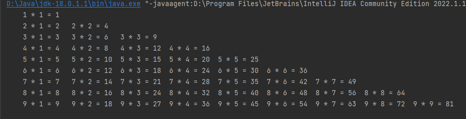

# JavaTrainingHomework
Java训练营作业 - 陈翰霖

### Week 1 :

- 源代码 ： (. / src / week1 / *.java)
- 运行截图：(. / img / week1 / *.png)

a. 例程
1. [乘法口诀表](./src/week1/MultiTable.java)
2. [数字游戏](./src/week1/)
3. [成绩处理](./src/week1/)

b. [冒泡排序法对用户输入字符串排序](./src/) 