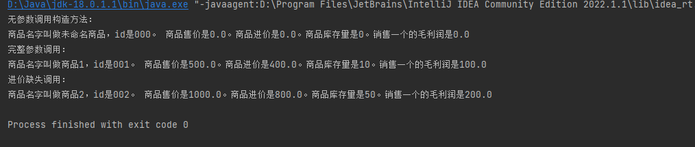

# JavaTrainingHomework
Java训练营作业 - 陈翰霖

### Week 2 :

- 运行代码(main): (./src/week2/.../*.java)
- 公共类： (./src/com/.../*.java)
- 运行截图: (./img/week2/.../*.png)

a. 例程： 
(对例程进行了一定的改动尝试，在每个作业截图后列出)

1. [打造一个小超市](./src/week2/a1)
    - 类：[com.person.Customer](./src/com/person/Customer.java)
    - 类：[com.supermarket.LittleSupermarket](./src/com/supermarket/LittleSupermarket.java)
    - 类：[com.supermarket.Merchandise](./src/com/supermarket/Merchandise.java)
    - main：[RunAppMain](./src/week2/a1/RunAppMain.java)
    - 运行截图：

2. [构造方法，静态方法和静态变量](./src/week2/a2)
   - [构造方法的重载和相互调用](./src/week2/a2/ConstructionMethod.java)
   
   - [静态方法和静态变量](./src/week2/a2/StaticVariableAndMethod.java)
   

3. [AI小程序](./src/week2/a3) 
   - 

b. [重构“猜数字游戏”程序](./src/week2/b)

### Week 1 :

- 源代码: (./src/week1/*.java)
- 运行截图: (./img/week1/*.png)

a. 例程
1. [乘法口诀表](./src/week1/MultiTable.java)

2. [数字游戏](./src/week1/GuessNumber.java)

3. [成绩处理](./src/week1/ScoreArray.java)

b. [冒泡排序法对用户输入字符串排序](./src/week1/BubbleSort.java)
 