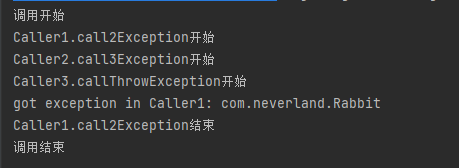

# JavaTrainingHomework
Java训练营作业 - 陈翰霖

## Week 4 :

a. 例程

1. 让城市与转起来，抛出异常的语法，Java异常的传递，自定义异常
   - [supermarket](./src/week4/a1/shopping) 

   - [异常](./src/week4/a1/exception)

2. collection中的List/Set，Map,Java中的File类
   - [list](./src/week4/a2/UseListAppMain.java)
   - [set](./src/week4/a2/UseSetAppMain.java)
   - [map](./src/week4/a2/LearnMapAppMain.java)
   - [file](./src/week4/a2/CreateDirAndFileAppMain.java)

b. 设计一个类，能实现（创建一个可自定义文件名的文件，并从用户输入写入文件内容，读出所有已存在.txt文件内容）

## Week 3 :

- 运行代码：([./src/week3/*.java](./src/week3))
- 公共类、接口等：([./src/com/...](./src/com))
- Images：([./img/week3/*.png](./img/week2))
- PlanUML File: ([./uml/*.puml](./uml))

a. 例程

1. [小超市中添加商品-手机](./src/week3/UsePhoneExtendsMerchandise.java)

2. [定义商品的门类，让商品类型更丰富，接口](./src/week3/UseInterface.java)

b. [让商品类型更丰富](./src/week3/UseChip.java)

## Week 2 :

- 运行代码(main): (./src/week2/.../*.java)
- 公共类: (./src/com/.../*.java)
- 运行截图: (./img/week2/*.png) 

a. 例程：

1. [打造一个小超市](./src/week2/a1)
    - 类：[com.person.Customer](./src/com/person/Customer.java)
    - 类：[com.supermarket.LittleSupermarket](./src/com/supermarket/LittleSupermarket.java)
    - 类：[com.supermarket.Merchandise](./src/com/supermarket/Merchandise.java)
    - main：[RunAppMain](./src/week2/a1/RunAppMain.java)
    - 运行截图：

2. [构造方法，静态方法和静态变量](./src/week2/a2)
   - [构造方法的重载和相互调用](./src/week2/a2/ConstructionMethod.java)
   
   - [静态方法和静态变量](./src/week2/a2/StaticVariableAndMethod.java)
   

3. [AI小程序](./src/week2/a3) 
   - 

b. [重构“猜数字游戏”程序](./src/week2/b)

## Week 1 :

- 源代码: (./src/week1/*.java)
- 运行截图: (./img/week1/*.png)

a. 例程
1. [乘法口诀表](./src/week1/MultiTable.java)

2. [数字游戏](./src/week1/GuessNumber.java)

3. [成绩处理](./src/week1/ScoreArray.java)

b. [冒泡排序法对用户输入字符串排序](./src/week1/BubbleSort.java)
 